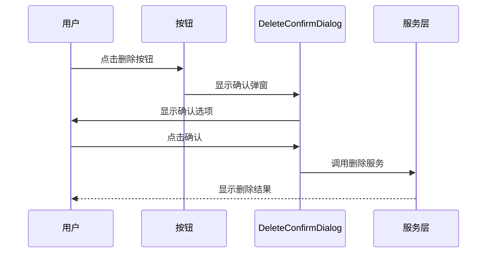
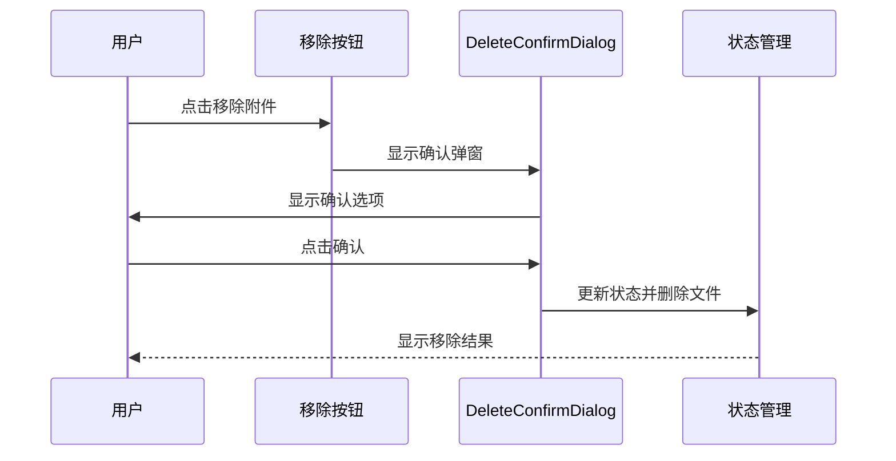

# 删除确认弹窗功能设计

## 1. 概述

本设计文档旨在为StepUp综合测评系统的删除操作添加二次确认弹窗功能。该功能将应用于两个主要场景：
1. 删除综测条目
2. 删除附件文件

通过添加确认弹窗，可以有效防止用户误操作导致的数据丢失，提升用户体验和数据安全性。

## 2. 技术栈

- Flutter 3.9+
- Dart SDK 3.9+
- sqflite数据库
- provider状态管理
- go_router路由管理

## 2. 功能需求

### 2.1 核心需求
- 在删除综测条目前显示确认弹窗
- 在删除附件文件前显示确认弹窗
- 提供明确的确认和取消选项
- 确认后执行删除操作，取消后返回原界面

### 2.2 用户体验要求
- 弹窗内容应清晰说明将要删除的内容
- 确认按钮使用红色标识以强调操作的不可逆性
- 取消按钮作为默认选项，用户按ESC或点击外部区域应等同于取消操作

### 2.3 安全要求
- 删除操作必须经过用户明确确认
- 删除确认弹窗应包含具体的删除内容信息
- 删除操作应提供明确的成功/失败反馈

## 3. 技术实现方案

### 3.1 现有组件分析

项目中已存在一个通用的删除确认对话框组件 `DeleteConfirmDialog`，位于 `lib/widgets/common_widgets.dart` 文件中：

```dart
class DeleteConfirmDialog extends StatelessWidget {
  final String title;
  final String content;
  final VoidCallback onConfirm;
  final VoidCallback? onCancel;
  final String confirmText;
  final String cancelText;

  const DeleteConfirmDialog({
    super.key,
    this.title = '确认删除',
    required this.content,
    required this.onConfirm,
    this.onCancel,
    this.confirmText = '删除',
    this.cancelText = '取消',
  });

  @override
  Widget build(BuildContext context) {
    return AlertDialog(
      title: Text(title),
      content: Text(content),
      actions: [
        TextButton(
          onPressed: onCancel ?? () => Navigator.of(context).pop(),
          child: Text(cancelText),
        ),
        FilledButton(
          onPressed: () {
            Navigator.of(context).pop();
            onConfirm();
          },
          style: FilledButton.styleFrom(
            backgroundColor: Colors.red,
          ),
          child: Text(confirmText),
        ),
      ],
    );
  }

  // 静态方法，方便调用
  static void show(
    BuildContext context, {
    String title = '确认删除',
    required String content,
    required VoidCallback onConfirm,
    VoidCallback? onCancel,
    String confirmText = '删除',
    String cancelText = '取消',
  }) {
    showDialog(
      context: context,
      builder: (context) => DeleteConfirmDialog(
        title: title,
        content: content,
        onConfirm: onConfirm,
        onCancel: onCancel,
        confirmText: confirmText,
        cancelText: cancelText,
      ),
    );
  }
}
```

### 3.2 实现策略

我们将复用现有的 `DeleteConfirmDialog` 组件，并在需要删除操作的地方调用该组件。该组件已经实现了标准的AlertDialog样式，具有良好的用户体验和视觉一致性。

## 4. 详细设计

### 4.1 删除条目确认弹窗

#### 4.1.1 评估列表页面 (AssessmentListPage)

在 `lib/pages/assessment_list_page.dart` 中，当前删除操作通过 `_showDeleteConfirmDialog` 方法处理。我们将修改此方法以使用通用组件：

1. 导入通用组件：
   ```dart
   import '../../widgets/common_widgets.dart';
   ```

2. 修改 `_showDeleteConfirmDialog` 方法：
   ```dart
   // 显示删除确认对话框
   void _showDeleteConfirmDialog(AssessmentItem item) {
     DeleteConfirmDialog.show(
       context,
       content: '确定要删除条目「${item.title}」吗？此操作不可撤销。',
       onConfirm: () => _deleteItem(item),
     );
   }
   ```



#### 4.1.2 评估表单页面 (AssessmentFormPage)

在 `lib/pages/assessment_form_page.dart` 中，当前删除操作通过 `_showDeleteConfirmDialog` 方法处理。同样需要修改为使用通用组件：

1. 导入通用组件：
   ```dart
   import '../../widgets/common_widgets.dart';
   ```

2. 修改 `_showDeleteConfirmDialog` 方法：
   ```dart
   // 显示删除确认对话框
   void _showDeleteConfirmDialog() {
     DeleteConfirmDialog.show(
       context,
       content: '确定要删除条目「${_currentItem?.title}」吗？此操作不可撤销。',
       onConfirm: _deleteItem,
     );
   }
   ```

### 4.2 删除附件确认弹窗

在 `lib/pages/assessment_form_page.dart` 中，附件移除操作通过 `_removeAttachment` 方法处理。我们将添加确认弹窗：

1. 创建新的确认方法 `_showRemoveAttachmentConfirmDialog`：
   ```dart
   // 显示移除附件确认对话框
   void _showRemoveAttachmentConfirmDialog(FileAttachment attachment) {
     DeleteConfirmDialog.show(
       context,
       content: '确定要移除文件「${attachment.fileName}」吗？文件将被永久删除。',
       onConfirm: () => _removeAttachment(attachment),
     );
   }
   ```

2. 修改附件列表中的移除按钮，调用新的确认方法：
   ```dart
   IconButton(
     onPressed: () => _showRemoveAttachmentConfirmDialog(attachment),
     icon: const Icon(Icons.close, size: 16),
     padding: EdgeInsets.zero,
     constraints: const BoxConstraints(minWidth: 32, minHeight: 32),
     tooltip: '移除',
   ),
   ```



## 5. UI/UX 设计

### 5.1 弹窗样式

使用现有的 `AlertDialog` 组件，保持与应用整体风格一致：

- 标题：红色粗体文本，显示"确认删除"
- 内容：描述将要删除的具体内容
- 按钮：
  - 取消按钮：文本按钮，位于左侧
  - 确认按钮：红色填充按钮，位于右侧

### 5.2 文案设计

1. 删除条目确认：
   - 标题：确认删除
   - 内容：确定要删除条目「条目名称」吗？此操作不可撤销。

2. 删除附件确认：
   - 标题：确认删除
   - 内容：确定要移除文件「文件名」吗？文件将被永久删除。

## 6. 实现步骤

### 6.1 修改评估列表页面

1. 在文件顶部导入通用组件：
   ```dart
   import '../../widgets/common_widgets.dart';
   ```

2. 修改 `_showDeleteConfirmDialog` 方法，使用通用组件：
   ```dart
   // 显示删除确认对话框
   void _showDeleteConfirmDialog(AssessmentItem item) {
     DeleteConfirmDialog.show(
       context,
       content: '确定要删除条目「${item.title}」吗？此操作不可撤销。',
       onConfirm: () => _deleteItem(item),
     );
   }
   ```

3. 保持原有功能逻辑不变

### 6.2 修改评估表单页面

1. 在文件顶部导入通用组件：
   ```dart
   import '../../widgets/common_widgets.dart';
   ```

2. 修改 `_showDeleteConfirmDialog` 方法，使用通用组件：
   ```dart
   // 显示删除确认对话框
   void _showDeleteConfirmDialog() {
     DeleteConfirmDialog.show(
       context,
       content: '确定要删除条目「${_currentItem?.title}」吗？此操作不可撤销。',
       onConfirm: _deleteItem,
     );
   }
   ```

3. 添加附件删除确认功能：
   - 创建新的 `_showRemoveAttachmentConfirmDialog` 方法
   - 修改附件列表中的移除按钮，调用新的确认方法

### 6.3 测试验证

1. 验证条目删除确认功能
2. 验证附件删除确认功能
3. 验证取消操作的正确性
4. 验证确认操作后删除功能的完整性

## 7. 错误处理

### 7.1 异常情况处理

1. 文件删除失败时显示错误提示
2. 数据库操作失败时显示错误提示
3. 确保删除失败时不会丢失数据

### 7.2 用户提示

所有操作结果都应通过 `SnackBar` 向用户反馈：
- 成功：显示绿色提示
- 失败：显示红色提示

## 8. 测试方案

### 8.1 单元测试

1. 测试 `DeleteConfirmDialog` 组件的显示逻辑
2. 测试确认和取消操作的回调执行
3. 测试弹窗的标题、内容和按钮文本显示正确性
4. 测试弹窗的默认行为（点击外部区域和ESC键）

### 8.2 集成测试

1. 测试从UI触发删除到实际执行删除的完整流程
2. 测试异常情况下的错误处理
3. 测试条目删除确认功能的完整流程
4. 测试附件删除确认功能的完整流程
5. 测试取消操作后不执行删除的正确性

## 9. 兼容性考虑

### 9.1 平台兼容性

确保在所有支持的平台（Windows、Android、iOS）上弹窗显示一致。

### 9.2 版本兼容性

该功能不涉及API变更，与现有版本完全兼容。

## 10. 性能影响

该功能对应用性能影响极小，仅在用户触发删除操作时显示弹窗，不会影响应用的正常运行性能。